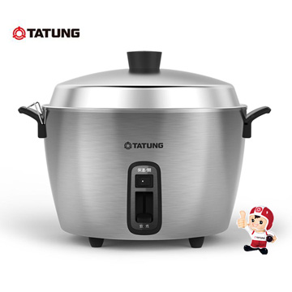
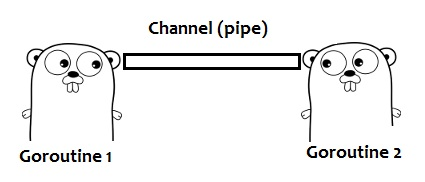

# 投影片底稿

## 今天就能帶回家的 Java coroutine！

## 前言

1. 架構設計有賺有賠，導入前請詳閱公開說明文件
2. 設計其實是在諸多選擇中的 trade off
3. 沒有最好，只有...
4. 大家考慮清楚、討論充足後，願意一同承擔風險的方案

## 今天的主角

### 不是我

1. 黃俊鈞
2. 一名程式員，現任職於資策會
3. 興趣是研究程式語言與它的執行環境、安全軟體開發與系統架構設計

### 也不是它

1. Quasar
2. Quasar is a library that provides high-performance lightweight threads, Go-like channels, Erlang-like actors, and other asynchronous programming tools for Java and Kotlin.
3. Quasar 是個提供了高效、輕量執行緒的函式庫，它有如同 Go 語言的 channels、Erlang 語言的 actors，還有其他供 Java 與 Kotlin 開發使用的非同步工具

### 是各位

1. 這是一個如同根基一般的框架
2. 選對框架帶你上天堂
3. 選錯框架讓你睡機房

## 今天的脈絡

1. 問題 → 需求
2. 需求 → 機制
3. 機制 → 實踐
4. 實踐 → 驗證

## 問題 → 需求

### 不知道，各位有沒有碰過這樣的問題？

### 假設我們有個這樣的計算問題

* 在 1 <= n <= 45 的費氏數列裡，有多少個數字是質數呢？

1. 為了表示耗時操作，本例皆用最慢演算法
2. 各位都是專業的工程師，請勿模仿本例寫法

### 費氏數列

```java
long fib(long n){
  if(n == 0 || n == 1){
    return n;
  }else{
    return fib(n - 1) + fib(n - 2);
  }
}
```

### 質數判定

```java
boolean isPrime(long value) {
  if (value <= 1) {
    return false;
  } else {
    for (long div = value - 1; div > 0; div--) {
      if ((value % div) == 0) { return div == 1; }
    }
    return false;
  }
}
```

### 同步執行


_圖片來源：Cama 官網_

### 難以體會嗎？


_圖片來源：輕旅行@yam.com_

### 同步執行的程式

```java
List<Long> checkPrimalityFib(long n){
  List<Long> numbers = new ArrayList<>();
  for(long i = 1; i <= n; i++){
    long fibNum = fib(i);
    if (isPrime(fibNum)){ numbers.add(i); }
  }
  return numbers;
}
```

### 但好景不常....

為了某些理由，我們把核心的計算工作與流程控制分開了，中間透過 Message Queue 介接，於是它們變成...

### 非同步執行



_圖片來源：PCHome_

### 或另一個看起來比較有效率的排隊


_圖片來源：輕旅行@yam.com_

### 非同步環境下的同步執行

```java
List<Long> checkPrimalityFib(long n){
  List<Long> numbers = new ArrayList<>();
  for(long i = 1; i <= n; i++){
    long fibNum = CALL_MQ_AND_WAIT(fib(i));
    if (CALL_MQ_AND_WAIT(isPrime(fibNum))){ numbers.add(i); }
  }
  return numbers;
}
```

### 非同步的 Event Driven

_讓我們來看一下程式_

### 程式脈絡已經與先前完全不同！

### 困難的，不是把它寫出來，而是寫完後要如何維護與擴充！

### 所以，我們有以下需求

1. 呼叫 Message Queue 的時候，程式可以暫停，而非等待
1. Message Queue 傳回執行結果後，程式可以恢復原本執行時的狀態
1. 程式碼可以維持清晰易讀的條理

## 需求 → 機制

### 解法一：Producer Consumer Pattern


_圖片來源：HowToDoInJava_

### 評價

1. 優點：
    * 使用 Java 原生的機制，具有最好的相容性與穩定性
    * 使用同步式開發，程式碼易於理解、維護
2. 缺點：
    * 所有 `wait` 在 `LinkedBlockingQueue` 上的 Producer 與 Consumer 都是活著的(activated) Thread
    * 若 ThreadPool 裡的 Thread 都在 `wait`，則會造成 ThreadPool 堵塞住
    * 若使用 `sleep` 則會造成頻繁 context switch 負擔
    * 若只是存取外部服務(Web、MQ...)，為何我們要耗用 CPU 的資源來等待呢？

### 解法二：Coroutine & Continuation

### Coroutine?

Coroutines are computer-program components that generalize subroutines for non-preemptive multitasking, by allowing multiple entry points for suspending and resuming execution at certain locations.

1. generalize subroutines for non-preemptive multitasking
2. 泛指用作非佔式多工的副程式 (執行單元)
3. by allowing multiple entry points
4. 藉著容許這副程式有多個進入點
5. for suspending and resuming execution at certain locations
6. 使得控制流得以在特定位置暫停或復原

### 怎麼做到？

### 想像一下，這是你的程式的 calling stack...


_圖片來源：大家的好朋友_

1. 程式是這樣一層一層呼叫上去，並且一層一層執行下來
2. 然而，如果我們有了這個神器！

### Continuation

1. Coroutine 不是語言特性，Continuation 才是！


### 評價

1. 優點：
    * 可以在同步式開發的程式裡，具備非同步的執行特性
    * 輕量化的 Thread - Fiber，可以建立大量的執行單元
    * 適用於非佔用 CPU 型的任務，如 IO、網路通訊等
2. 缺點：
    * 引入了外部(Java Agent)工具，增加部署上的負擔
    * 為了保持邏輯正確性，需要把 Fiber 暫停前的資料暫存起來
    * 框架間相容性需要更深入研究
    * 框架都很冷門，甚至有的已經沒有在維護
      * Commons JavaFlow
      * Kilim
      * Java RIFE
      * 還有今天的 Quasar

### 當然還有：Asynchronous

### 評價

1. 優點：
    * 本質上完全相容於 Message Queue 訊息來往的特性
    * 已有許多成熟的專案可支援
        * Akka
        * Vert.x
2. 缺點：
    * 既有架構必須完全改寫
    * 需要使用記憶體快取或資料持久化機制，來儲存每一個階段做到一半的資料
    * 業務邏輯散落各處，一旦需求改變，便難以修正
    * Akka 引入了 Scala，我並不想讓一個系統裡頭有兩種語言並存...
    * 學習曲線較高，我自己也被困了很久，還是對其他人好一點吧....

### 最後選擇

[Quasar](Quasar)

## 機制 → 實踐

## Quasar 101

### [QuasarWeb](QuasarWeb)

### [Quasar@MvnRepo](Quasar@MvnRepo)

### Fiber & Channel

我們借一下 Go 的圖



_圖片來源：知乎_

### PrimalityFiber

### Gradle

```groovy
configurations {
  quasar
}
dependencies {
  compile  "co.paralleluniverse:quasar-core:0.7.10:jdk8"
  quasar   "co.paralleluniverse:quasar-core:0.7.10:jdk8@jar"
}
test {
  jvmArgs "-javaagent:${configurations.quasar.singleFile}"
}
```

### 小眉角

```groovy
task copyQuasar(type: Copy) {
    into "$projectDir/lib"
    from configurations.quasar
}
build.finalizedBy(copyQuasar)
```

### Fiber

```java
public class PrimalityFiber implements SuspendableCallable<List<Long>> {
  @Override
  public List<Long> run() throws SuspendExecution, InterruptedException {
    ...
  }
}
```

### 與 Channel 共舞

```java
  List<Long> result = new ArrayList<>();

  for (long i = 1; i <= n; i++) {
      Long fibResult = receiveFromChannel(service.calFib(i));
      Boolean primeResult = receiveFromChannel(service.calPrime(fibResult));
      if (primeResult) {result.add(i);}
  }

  return result;
```

### 謎底

```java
  @Suspendable
  protected <T> T receiveFromChannel(Channel<T> channel) 
        throws InterruptedException, SuspendExecution {
      return channel.receive();
  }
```

```java
public Channel<Long> calFib(long n) {
  CommandMessage<Long> fibCmd = createFibCommand(n);
  Channel<Long> channel = Channels.newChannel(1);
  sender.sendCommand(convertJsonFromObject(fibCmd));
  return channel;
}
```

```java
  @Suspendable
  private static <R> void resume(ResultMessage<R> result, Class<R> type) {
    ...

    Optional<Channel<R>> maybe = channels.find(result.getId(), type);
    if (maybe.isPresent()) {
      Channel<R> channel = maybe.get();
      try {
        channel.send(result.getResult());
      } catch (InterruptedException | SuspendExecution ex) {
        // ignore it
      }
    }
  }
```

## 實踐 → 驗證

_<直接看程式>_

## 深入探討 － Quasar

### JavaAgent?

### Why not AOT?

### SuspendExecution?